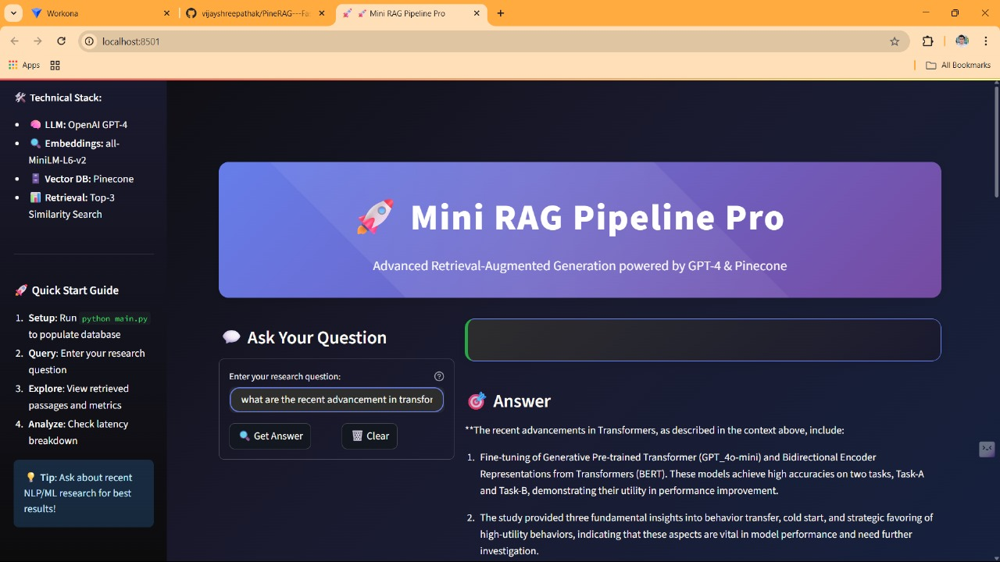
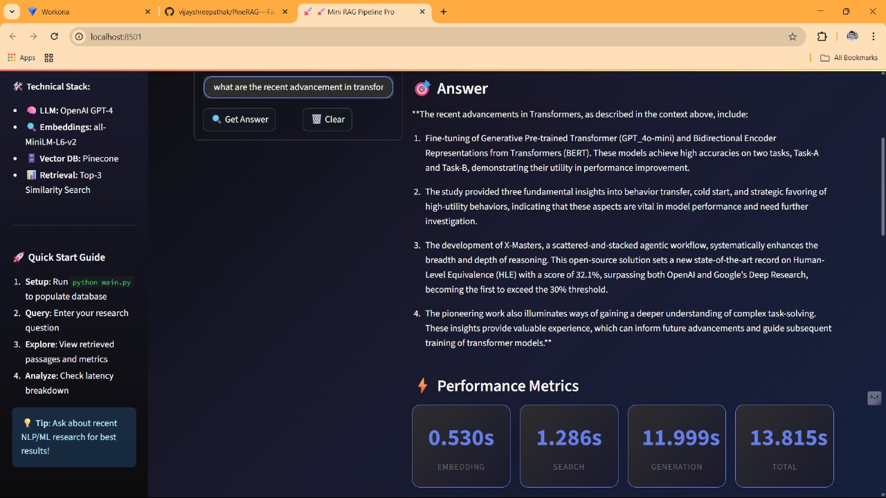
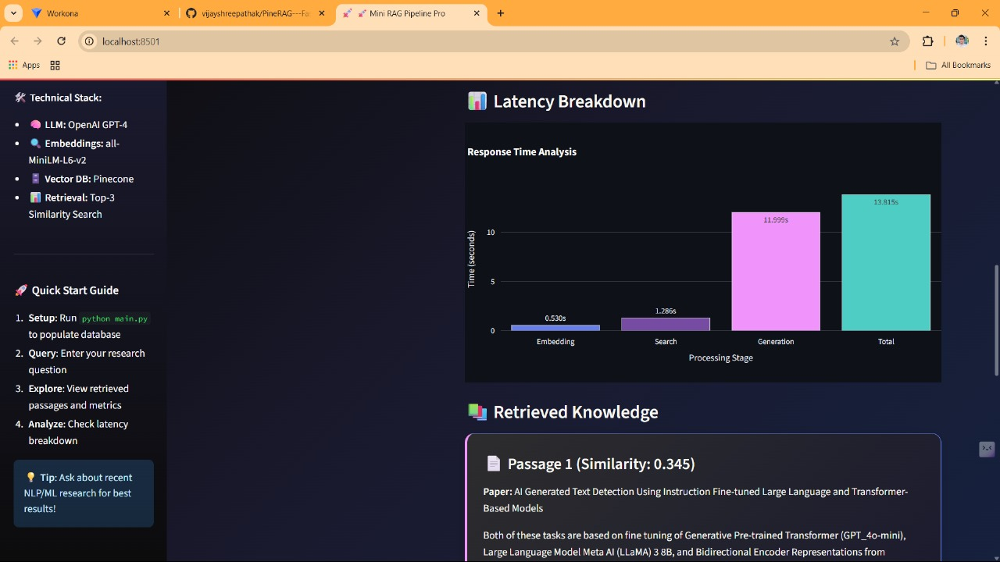
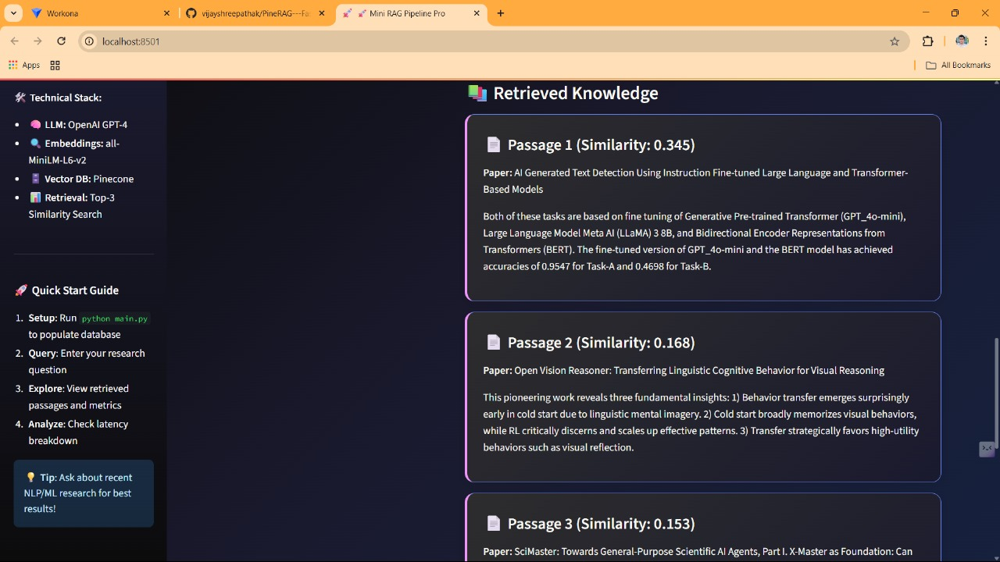
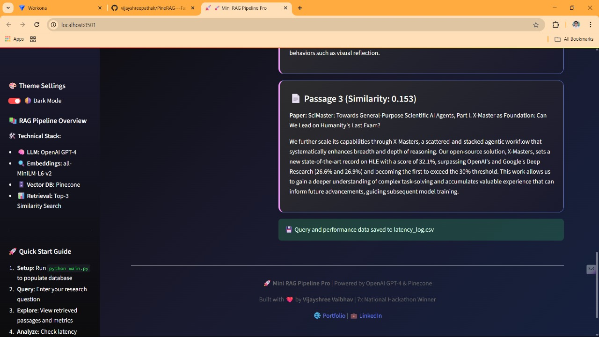

# Mini RAG Pipeline Pro 🚀

## Overview
This project implements a modern Retrieval-Augmented Generation (RAG) pipeline for academic Q&A, featuring a beautiful Streamlit web UI with dark/light mode, real-time latency analytics, and interactive querying. It ingests academic papers from arXiv, embeds and stores them in Pinecone, and uses an LLM to answer questions based on retrieved content. Each pipeline stage's latency is logged, visualized, and saved for analysis.

---

## Model & Design Choices
- **Embedding Model:** `sentence-transformers/all-MiniLM-L6-v2`
- **LLM:** OpenAI GPT-4 (via `openai` Python SDK)
- **Vector DB:** Pinecone (cloud='aws', region='us-east-1')
- **Chunking:** Abstracts split into 3-sentence passages
- **UI:** Streamlit with advanced CSS, theme toggle, Lottie animations, and Plotly for latency visualization

---

## Key Features
- 🌗 **Dark/Light Theme Toggle**: Instantly switch between beautiful dark and light modes from the sidebar.
- 📊 **Real-Time Latency Analytics**: View detailed latency metrics for each pipeline stage (Embedding, Search, Generation, Total) as metrics and a Plotly bar chart.
- 📝 **Query Logging**: Every query, answer, and latency breakdown is saved to `latency_log.csv` for later analysis.
- 🧑‍💻 **Modern UI/UX**: Enhanced sidebar with technical stack, usage stats, and a quick start guide. Lottie animations and custom CSS for a premium experience.
- 🧠 **Top-3 Passage Retrieval**: See the most relevant passages retrieved for your question, with similarity scores and paper titles.
- 🛡️ **Robust Error Handling**: Friendly error messages and guidance if the database is not yet populated.
- 🏆 **Attribution & Links**: Footer credits and links to the author’s portfolio and LinkedIn.

---

## Usage

### Setup

1. Install dependencies:
   ```
   pip install -r requirements.txt
   ```

2. Set your API keys in a `.env` file:
   ```
   OPENAI_API_KEY=your_openai_key
   PINECONE_API_KEY=your_pinecone_key
   ```

3. Populate the Pinecone database:
   ```
   python main.py
   ```

4. Launch the Streamlit UI:
   ```
   streamlit run app.py
   ```

---

## How to Use the Web App
- **Theme Toggle:** Use the sidebar switch to toggle between dark and light modes.
- **Ask a Question:** Enter your research question in the left panel and click "🔍 Get Answer".
- **Clear Query:** Use the "🗑️ Clear" button to reset the input and results.
- **View Results:** See the generated answer, latency metrics, a latency bar chart, and the top-3 retrieved passages.
- **Usage Stats:** Sidebar shows total queries and average response time (if `latency_log.csv` exists).
- **Quick Start Guide:** Sidebar provides step-by-step instructions for new users.

---

## Sample Query & Result

- **Query:** What are recent advances in language modeling?

- **Generated Answer:**
  > Recent advances in language modeling involve the development of Large Language Models (LLMs) and Multimodal Large Language Models (MLLMs). These models are capable of producing text that is coherent, contextually relevant, and strikingly similar to human writing. They are versatile and adaptable to various styles and genres, producing content that is grammatically correct and semantically meaningful.

  (…truncated for brevity…)

- **Top 3 Retrieved Passages:**
  1. Title: AI Generated Text Detection Using Instruction Fine-tuned Large Language and Transformer-Based Models
  2. Title: OpenS2S: Advancing Open-Source End-to-End Empathetic Large Speech Language Model
  3. Title: Open Vision Reasoner: Transferring Linguistic Cognitive Behavior for Visual Reasoning

- **Latency:**
  - Embedding: 0.079s
  - Search: 1.365s
  - Generation: 15.26s
  - Total: 16.71s

---

## Files
- `main.py` — Main pipeline script (data ingestion, embedding, upsert, CLI query)
- `app.py` — Streamlit web UI for interactive querying, theme toggle, and latency visualization
- `latency_log.csv` — Latency logs for each query
- `README.md` — This file
- `requirements.txt` — Python dependencies


## Screenshots

### Main UI


### Query Example


### Latency Metrics


### Theme Toggle


### Retrieved Passages


---


## Credits
Built with ❤️ by **Vijayshree Vaibhav** | 7x National Hackathon Winner  
[🌐 Portfolio](https://vijayshreepathak.netlify.app/) | [💼 LinkedIn](https://www.linkedin.com/in/vijayshreevaibhav) 
